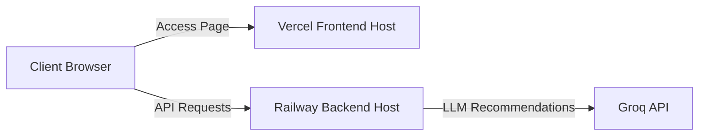

# Zomato Recommender Deployment Plan

This document provides step-by-step instructions for deploying the **FastAPI Backend** on Railway and the **Vite React Frontend** on Vercel.

---

## Architecture Overview



---

## Part 1: Backend Deployment on Railway

Railway is a serverless platform ideal for running FastAPI apps. It supports Python out-of-the-box and will use our [Procfile](file:///c:/Users/KIIT0001/Desktop/Zomato%20Milestone-1/Procfile) to run the server.

### 1. Prerequisites & Preparation
- You have already pushed the code to your GitHub Repository: `https://github.com/mrigank-raj/Zomato-milestone1.git`.
- Make sure you have a Railway account connected to your GitHub.

### 2. Steps to Deploy on Railway
1. Go to the [Railway Dashboard](https://railway.app/).
2. Click **+ New Project** -> **Deploy from GitHub repo**.
3. Select your repository: `Zomato-milestone1`.
4. Railway will analyze the repository. It will detect the root Python setup and use the [Procfile](file:///c:/Users/KIIT0001/Desktop/Zomato%20Milestone-1/Procfile):
   ```yaml
   web: uvicorn app.server:app --host 0.0.0.0 --port $PORT
   ```
5. Click on your newly created service box in Railway, go to the **Variables** tab, and add the following environment variables:
   - `GROQ_API_KEY`: *(Your actual Groq API Key, e.g. `gsk_...`)*
   - `ALLOWED_ORIGINS`: *(Set this to your Vercel deployment URL once you have it, e.g. `https://zomato-milestone1.vercel.app`. For initial build/testing, you can set it to `*` or leave it blank to fall back to localhost)*
   - `LLM_MODEL`: `llama-3.3-70b-versatile` *(Optional)*
   - `LLM_TEMPERATURE`: `0.3` *(Optional)*
   - `DATASET_CACHE_PATH`: `data/cache.csv` *(Optional)*
6. Go to the **Settings** tab -> **Environment** -> Click **Generate Domain**. This will give you a public URL for your backend (e.g. `https://zomato-milestone1-production.up.railway.app`).
7. **Important Note on Dataset Cache**:
   - The first time the backend starts, it will download and cache the Zomato dataset (30,000 entries) from Hugging Face since `data/cache.csv` is git-ignored.
   - Ensure the Railway service tier has at least **512MB RAM** (the default starter tier has this) to handle pandas dataframe operations during initialization.

---

## Part 2: Frontend Deployment on Vercel

Vercel is optimized for frontend applications. Since our React code resides in the `frontend` subdirectory, we need to configure Vercel's root directory setting.

### 1. Steps to Deploy on Vercel
1. Go to the [Vercel Dashboard](https://vercel.com/).
2. Click **Add New** -> **Project**.
3. Import your GitHub repository: `Zomato-milestone1`.
4. In the **Configure Project** step:
   - **Framework Preset**: Select **Vite** (Vercel should auto-detect this).
   - **Root Directory**: Click *Edit* and select the **`frontend`** directory (do NOT select the main repository root).
   - **Build and Output Settings**: Keep default settings (`npm run build` and `dist`).
5. Open the **Environment Variables** section and add the API connection URL:
   - Name: `VITE_API_BASE_URL`
   - Value: *(Your Railway backend URL, e.g., `https://zomato-milestone1-production.up.railway.app`)*
6. Click **Deploy**.
7. Once deployment is complete, Vercel will provide your frontend URL (e.g. `https://zomato-milestone1.vercel.app`).

---

## Part 3: Connecting Both & Post-Deployment Checklist

Once both services are deployed, update the CORS origin on Railway to prevent unauthorized requests while allowing your frontend to connect.

1. Copy the Vercel URL (e.g. `https://zomato-milestone1.vercel.app`).
2. Go to your Railway service -> **Variables**.
3. Update the `ALLOWED_ORIGINS` variable value to match your Vercel URL:
   ```env
   ALLOWED_ORIGINS=https://zomato-milestone1.vercel.app
   ```
4. Railway will automatically redeploy the backend with the updated CORS policy.
5. Visit your Vercel URL and run a test query (e.g. select Location, Cuisine, and click recommendation) to verify the pipeline.
