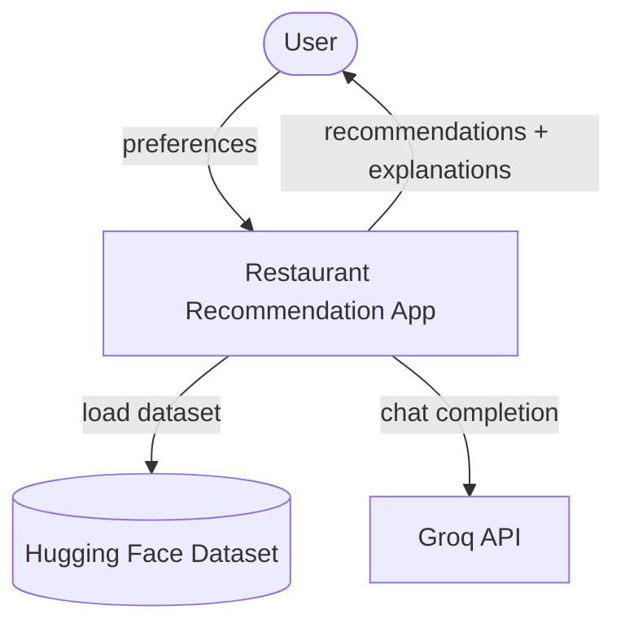
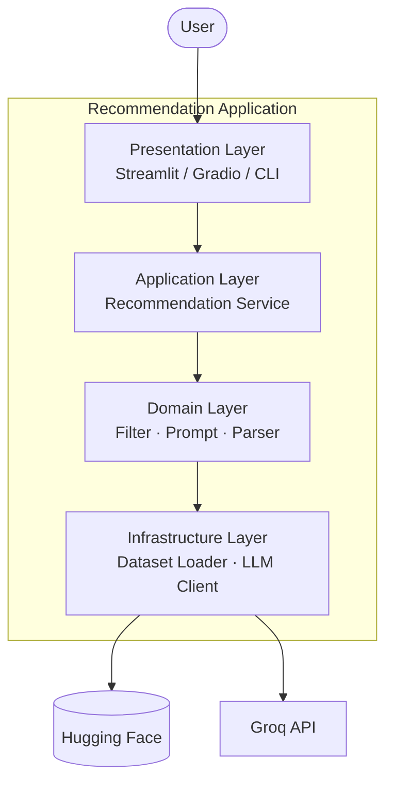
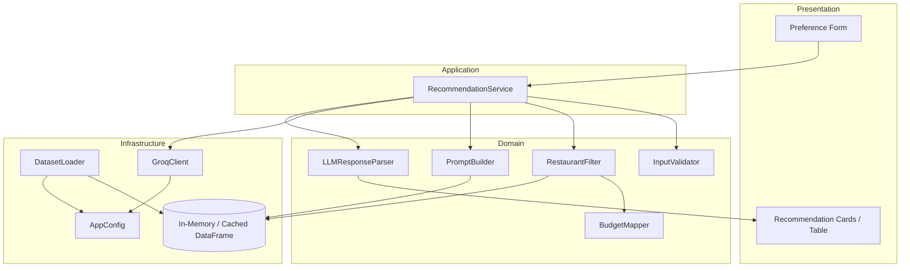
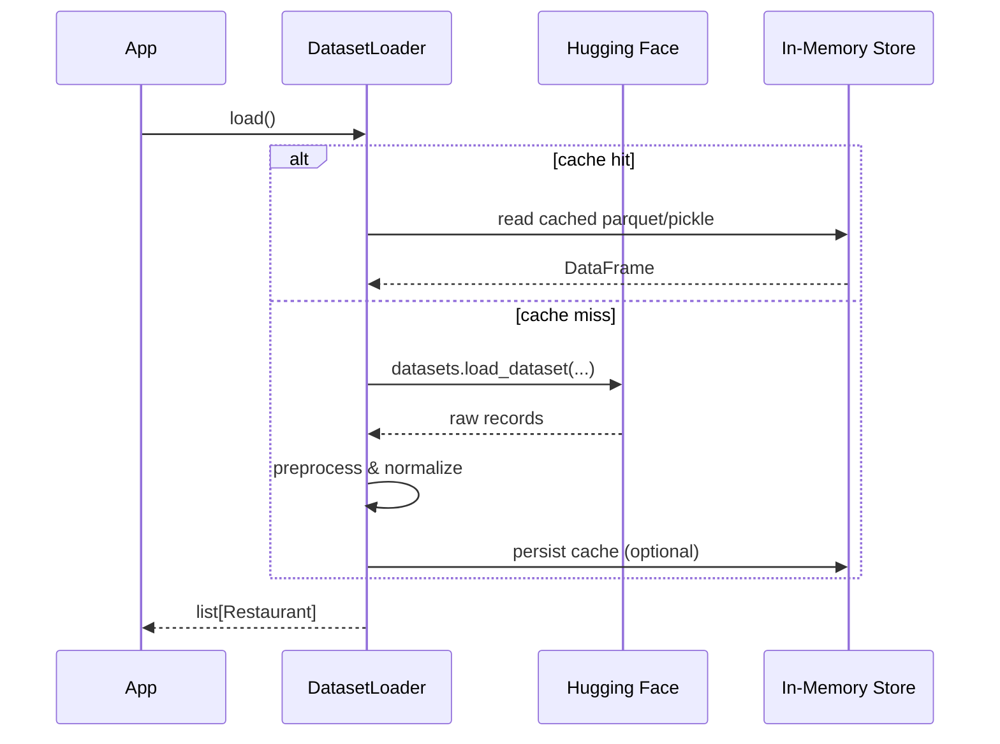
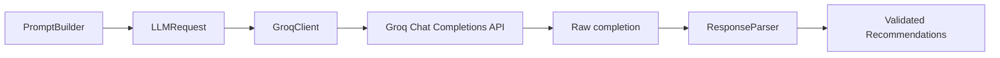
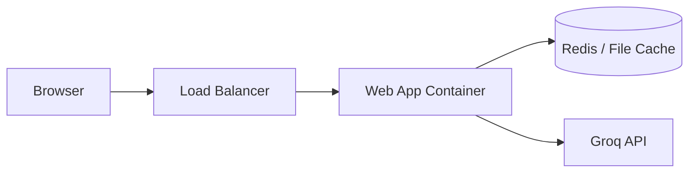

# AI-Powered Restaurant Recommendation System — Architecture

This document defines the **technical architecture** for the Zomato-inspired recommendation service described in [`context.md`](context.md). It specifies layers, components, data contracts, and interaction patterns for implementation.

**LLM provider:** [Groq](https://console.groq.com/) — used for ranking filtered restaurant candidates and generating personalized explanations.

---

## 1. Architectural Goals

| Goal | Description |
|---|---|
| **Separation of concerns** | Data loading, filtering, LLM orchestration, and presentation are isolated modules |
| **Grounded recommendations** | LLM only ranks/explains candidates from structured filters — no free-form restaurant invention |
| **Testability** | Core logic (filtering, prompt building, response parsing) is unit-testable without the UI or live LLM |
| **Extensibility** | Swap UI or dataset source with minimal changes; LLM is Groq-backed via a thin client abstraction |
| **Efficiency** | Cache preprocessed data; cap candidates sent to the LLM to control cost and latency |

---

## 2. Architecture Style

The system uses a **layered pipeline architecture** with a clear unidirectional flow:

```
Presentation → Application → Domain → Infrastructure
```

There is no microservices requirement for Milestone 1. A **modular monolith** (single deployable app with well-defined internal modules) is sufficient.

---

## 3. System Context (C4 — Level 1)



**External actors & systems:**

| Entity | Role |
|---|---|
| **User** | Submits dining preferences; receives ranked recommendations |
| **Hugging Face** | Hosts the Zomato restaurant dataset |
| **Groq** | Hosts the LLM (e.g. Llama, Mixtral) used to rank candidates and generate natural-language explanations |

---

## 4. Container View (C4 — Level 2)

For Milestone 1, all containers run within a single application process.



| Container | Responsibility |
|---|---|
| **Presentation Layer** | Collects user input, renders results, handles UX validation |
| **Application Layer** | Orchestrates the recommendation workflow end-to-end |
| **Domain Layer** | Business rules: filtering, budget mapping, prompt templates, output parsing |
| **Infrastructure Layer** | I/O adapters: dataset fetch/cache, Groq LLM client, config |

---

## 5. Component View (C4 — Level 3)

### 5.1 Component Diagram



### 5.2 Component Responsibilities

| Component | Layer | Responsibility |
|---|---|---|
| `PreferenceForm` | Presentation | Renders inputs: location, budget, cuisine, min rating, extras |
| `ResultView` | Presentation | Displays top-N recommendations with structured + narrative fields |
| `RecommendationService` | Application | Single entry point: `get_recommendations(preferences) → List[Recommendation]` |
| `InputValidator` | Domain | Validates and normalizes user preferences |
| `RestaurantFilter` | Domain | Applies hard filters on preprocessed dataset |
| `BudgetMapper` | Domain | Maps low/medium/high to numeric cost ranges |
| `PromptBuilder` | Domain | Assembles system + user prompts from preferences and candidates |
| `LLMResponseParser` | Domain | Parses LLM output into typed `Recommendation` objects; validates against candidates |
| `DatasetLoader` | Infrastructure | Loads Hugging Face dataset, preprocesses, caches |
| `GroqClient` | Infrastructure | Calls Groq Chat Completions API via the official `groq` SDK |
| `AppConfig` | Infrastructure | Reads env vars: `GROQ_API_KEY`, model name, candidate limit |

---

## 6. Recommended Project Structure

```
zomato-recommendation/
├── app/
│   ├── main.py                 # Entry point (Streamlit / CLI / FastAPI)
│   ├── presentation/
│   │   ├── forms.py            # User input components
│   │   └── views.py            # Result rendering
│   ├── application/
│   │   └── recommendation_service.py
│   ├── domain/
│   │   ├── models.py           # UserPreferences, Restaurant, Recommendation
│   │   ├── validator.py
│   │   ├── filter.py
│   │   ├── budget.py
│   │   ├── prompt_builder.py
│   │   └── response_parser.py
│   └── infrastructure/
│       ├── config.py
│       ├── dataset_loader.py
│       └── llm/
│           ├── base.py         # LLMClient protocol / ABC
│           └── groq_client.py  # Groq Chat Completions implementation
├── data/
│   └── .gitkeep                # Optional local cache
├── tests/
│   ├── test_filter.py
│   ├── test_prompt_builder.py
│   └── test_response_parser.py
├── .env.example                # GROQ_API_KEY, LLM_MODEL, etc.
├── requirements.txt            # includes groq, datasets, pandas, streamlit
└── README.md
```

---

## 7. Data Models

### 7.1 UserPreferences

```python
@dataclass
class UserPreferences:
    location: str              # e.g. "Bangalore"
    budget: Literal["low", "medium", "high"]
    cuisine: str               # e.g. "Italian"
    min_rating: float          # e.g. 4.0
    additional: str | None     # e.g. "family-friendly, quick service"
    top_n: int = 5             # number of recommendations to return
```

### 7.2 Restaurant (normalized domain entity)

```python
@dataclass
class Restaurant:
    id: str
    name: str
    location: str
    cuisines: list[str]
    rating: float
    cost_for_two: int | None   # normalized numeric cost
    address: str | None
    votes: int | None
    raw: dict                  # original row for debugging / future fields
```

### 7.3 Recommendation (output entity)

```python
@dataclass
class Recommendation:
    restaurant: Restaurant
    rank: int
    explanation: str           # LLM-generated
    summary: str | None        # optional overall summary (first item only)
```

### 7.4 LLMRequest / LLMResponse (internal)

```python
@dataclass
class LLMRequest:
    system_prompt: str
    user_prompt: str
    model: str
    temperature: float

@dataclass
class LLMResponse:
    raw_text: str
    parsed_recommendations: list[Recommendation]
```

---

## 8. Layer Contracts

### 8.1 Presentation → Application

```python
def get_recommendations(prefs: UserPreferences) -> list[Recommendation]:
    ...
```

The presentation layer does **not** call the filter or LLM directly.

### 8.2 Application → Domain

| Step | Call | Input | Output |
|---|---|---|---|
| 1 | `InputValidator.validate(prefs)` | Raw form data | `UserPreferences` |
| 2 | `RestaurantFilter.apply(restaurants, prefs)` | Full dataset + prefs | `list[Restaurant]` (candidates) |
| 3 | `PromptBuilder.build(prefs, candidates)` | Prefs + capped candidates | `LLMRequest` |
| 4 | `LLMResponseParser.parse(raw, candidates)` | LLM text + candidates | `list[Recommendation]` |

### 8.3 Application → Infrastructure

```python
class DatasetLoader:
    def load(self) -> list[Restaurant]: ...

class LLMClient(Protocol):
    """Implemented by GroqClient for Milestone 1."""
    def complete(self, request: LLMRequest) -> str: ...
```

---

## 9. Core Workflows

### 9.1 Startup / Data Load



**Preprocessing steps:**

1. Drop or impute rows with missing critical fields (name, location)
2. Normalize location strings (case, trim, alias mapping if needed)
3. Split cuisine strings into `list[str]`
4. Parse cost fields to integer `cost_for_two`
5. Coerce rating to `float`
6. Assign stable `id` per row (index or hash)

### 9.2 Recommendation Request (happy path)

```mermaid
sequenceDiagram
    participant User
    participant UI
    participant Svc as RecommendationService
    participant Val as InputValidator
    participant Fil as RestaurantFilter
    participant PB as PromptBuilder
    participant LLM as LLMClient
    participant Par as ResponseParser

    User->>UI: Submit preferences
    UI->>Svc: get_recommendations(prefs)
    Svc->>Val: validate(prefs)
    Val-->>Svc: UserPreferences
    Svc->>Fil: apply(all_restaurants, prefs)
    Fil-->>Svc: candidates (≤ MAX_CANDIDATES)

    alt no candidates
        Svc-->>UI: empty list + message
    else has candidates
        Svc->>PB: build(prefs, candidates)
        PB-->>Svc: LLMRequest
        Svc->>LLM: complete(request)
        LLM-->>Svc: raw_text
        Svc->>Par: parse(raw_text, candidates)
        Par-->>Svc: list[Recommendation]
        Svc-->>UI: recommendations
        UI-->>User: display results
    end
```

### 9.3 Filtering Logic

Hard filters applied **in order** (short-circuit optional for performance):

| Filter | Rule |
|---|---|
| Location | Case-insensitive match on city/location field |
| Min rating | `restaurant.rating >= prefs.min_rating` |
| Cuisine | Any cuisine in `restaurant.cuisines` matches requested cuisine (substring or exact) |
| Budget | `cost_for_two` within range from `BudgetMapper` |

**Budget mapping (default — tune to dataset distribution):**

| Tier | Cost for two (₹) |
|---|---|
| Low | 0 – 500 |
| Medium | 501 – 1500 |
| High | 1501+ |

After filtering, **cap candidates** (e.g., top 20 by rating) before sending to the LLM.

### 9.4 LLM Integration Architecture (Groq)

This project uses **[Groq](https://console.groq.com/)** as the LLM provider. Groq exposes an OpenAI-compatible Chat Completions API with very low latency, which suits interactive recommendation flows in Streamlit.



**Implementation:** `GroqClient` implements the `LLMClient` protocol using the official [`groq`](https://pypi.org/project/groq/) Python SDK. Application and domain code depend only on the protocol — not on Groq-specific types.

**Recommended Groq models (starting point):**

| Model | Use case |
|---|---|
| `llama-3.3-70b-versatile` | Default — strong reasoning and JSON adherence |
| `llama-3.1-8b-instant` | Faster/cheaper dev and testing |
| `mixtral-8x7b-32768` | Alternative if larger context is needed |

**Recommended request settings:**

| Parameter | Value | Rationale |
|---|---|---|
| Temperature | 0.2 – 0.5 | Lower variance; more consistent ranking |
| Max tokens | 1500 – 2500 | Enough for top-5 explanations |
| Response format | JSON via prompt instruction | Groq models follow schema when explicitly requested in the system prompt |

**Example Groq client call (conceptual):**

```python
from groq import Groq

client = Groq(api_key=config.groq_api_key)
response = client.chat.completions.create(
    model=config.llm_model,          # e.g. "llama-3.3-70b-versatile"
    messages=[
        {"role": "system", "content": request.system_prompt},
        {"role": "user", "content": request.user_prompt},
    ],
    temperature=request.temperature,
    max_tokens=2500,
)
return response.choices[0].message.content
```

---

## 10. Prompt Architecture

### 10.1 Two-part prompt structure

| Part | Purpose |
|---|---|
| **System prompt** | Role, constraints, output schema, anti-hallucination rules |
| **User prompt** | User preferences + serialized candidate list |

### 10.2 System prompt (template)

```
You are a restaurant recommendation assistant for a Zomato-like app.

Rules:
- Recommend ONLY from the CANDIDATES list provided.
- Do NOT invent restaurant names or attributes.
- Rank by best fit to USER PREFERENCES.
- Consider additional preferences (e.g. family-friendly) even if not in structured data.
- Return valid JSON matching the schema below.

Output schema:
{
  "recommendations": [
    {
      "restaurant_id": "<id from candidates>",
      "rank": 1,
      "explanation": "<2-3 sentences>"
    }
  ],
  "summary": "<optional one-line overview>"
}
```

### 10.3 User prompt (template)

```
USER PREFERENCES:
- Location: {location}
- Budget: {budget}
- Cuisine: {cuisine}
- Minimum rating: {min_rating}
- Additional: {additional}

CANDIDATES:
{json_or_table_of_candidates}
```

### 10.4 Grounding & validation (post-LLM)

`LLMResponseParser` must:

1. Parse JSON (with fallback regex if malformed)
2. Verify every `restaurant_id` exists in the candidate set
3. Drop or flag hallucinated entries
4. Merge LLM explanation with canonical `Restaurant` fields from dataset
5. Sort by `rank` and truncate to `top_n`

---

## 11. Error Handling Strategy

| Scenario | Layer | Behavior |
|---|---|---|
| Invalid user input | Domain (`InputValidator`) | Return validation errors to UI; do not call LLM |
| Dataset load failure | Infrastructure | Log error; show user-friendly message; retry once |
| Zero filter matches | Domain (`RestaurantFilter`) | Return empty state: "No restaurants match. Try relaxing filters." |
| Groq timeout / API error | Infrastructure (`GroqClient`) | Retry with backoff (1–2 attempts); fallback message |
| Malformed LLM JSON | Domain (`ResponseParser`) | Retry LLM once with "fix JSON" instruction; else fallback to rating-sorted list without explanations |
| Hallucinated restaurant IDs | Domain (`ResponseParser`) | Strip invalid entries; log warning |

---

## 12. Configuration

Environment variables (via `.env`):

| Variable | Required | Description |
|---|---|---|
| `GROQ_API_KEY` | Yes | API key from [Groq Console](https://console.groq.com/keys) |
| `LLM_MODEL` | No | Groq model ID; default `llama-3.3-70b-versatile` |
| `LLM_TEMPERATURE` | No | Default `0.3` |
| `MAX_CANDIDATES` | No | Default `20` |
| `DATASET_CACHE_PATH` | No | Local cache file path |
| `LOG_LEVEL` | No | `INFO` default |

**Example `.env`:**

```
GROQ_API_KEY=gsk_...
LLM_MODEL=llama-3.3-70b-versatile
LLM_TEMPERATURE=0.3
MAX_CANDIDATES=20
```

---

## 13. Non-Functional Requirements

| Attribute | Target (Milestone 1) |
|---|---|
| **Latency** | < 5s end-to-end (Groq inference is typically sub-second; filtering + UI dominate less) |
| **Cost** | Cap candidates + use `llama-3.1-8b-instant` for dev; Groq free tier for prototyping |
| **Reliability** | Graceful degradation when LLM unavailable |
| **Maintainability** | Domain logic has no UI or HTTP imports |
| **Security** | API keys in env only; never committed |

---

## 14. Testing Strategy

| Test type | Scope | Approach |
|---|---|---|
| **Unit** | `RestaurantFilter`, `BudgetMapper`, `PromptBuilder`, `ResponseParser` | Pure functions with fixture data |
| **Integration** | `DatasetLoader` | Mock Hugging Face or use cached sample |
| **Integration** | `GroqClient` | Mock responses; optional live Groq test behind `pytest -m live` flag |
| **E2E** | Full flow | Submit prefs → receive ranked list (manual or automated) |

**Critical test cases:**

- Filter returns only matching location/cuisine/rating/budget
- Prompt includes all candidates and preferences
- Parser rejects IDs not in candidate set
- Empty filter result does not call LLM

---

## 15. Deployment View (Future)

Milestone 1 is local-first. A future production layout:



Not required for initial milestone. See **Out of Scope** in [`context.md`](context.md).

---

## 16. Architecture Decision Records (Summary)

| ID | Decision | Rationale |
|---|---|---|
| ADR-001 | Layered monolith over microservices | Simplicity for milestone; clear module boundaries |
| ADR-002 | Filter before LLM | Reduces tokens, cost, and hallucination surface |
| ADR-003 | Structured JSON LLM output | Reliable parsing; merge with dataset fields |
| ADR-004 | Groq as LLM provider | Fast inference, simple SDK, free tier; `LLMClient` protocol keeps domain decoupled |
| ADR-005 | Cap candidates at ~20 | Balance context quality vs. latency and cost |
| ADR-006 | Cache preprocessed dataset | Avoid re-downloading on every app start |

---

## 17. References

- [`context.md`](context.md) — Project context, objectives, acceptance criteria
- [`ProblemStatement.txt`](ProblemStatement.txt) — Original problem statement
- [Hugging Face Dataset](https://huggingface.co/datasets/ManikaSaini/zomato-restaurant-recommendation)
- [Groq Console](https://console.groq.com/) — API keys and model catalog
- [Groq Python SDK](https://github.com/groq/groq-python) — Official client library
