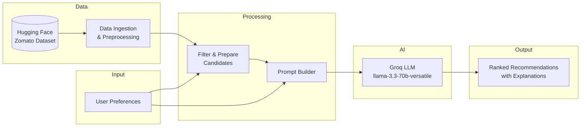
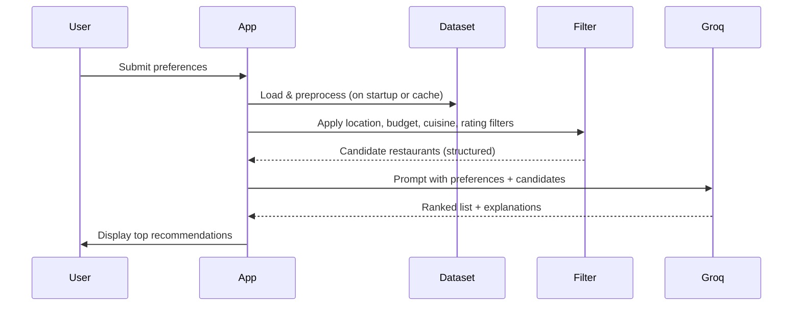

# AI-Powered Restaurant Recommendation System — Project Context

## Overview

This project is a **Zomato-inspired, AI-powered restaurant recommendation service**. It combines structured restaurant data with **[Groq](https://console.groq.com/)** — a fast LLM inference platform — to deliver personalized, human-like dining suggestions based on user preferences.

The system is not a simple filter-and-sort tool. It uses deterministic data filtering to narrow the candidate set, then delegates **ranking, reasoning, and explanation** to a Groq-hosted model so recommendations feel tailored and understandable.

---

## Primary Objective

Design and implement an application that:

1. Accepts user preferences (location, budget, cuisine, ratings, and more)
2. Uses a **real-world Zomato restaurant dataset**
3. Leverages **Groq** to generate personalized, natural-language recommendations
4. Presents results in a **clear, user-friendly** format

---

## Data Source

| Property | Value |
|---|---|
| **Dataset** | Zomato Restaurant Recommendation |
| **Provider** | Hugging Face |
| **URL** | https://huggingface.co/datasets/ManikaSaini/zomato-restaurant-recommendation |

### Expected Fields (after ingestion & preprocessing)

Extract and normalize fields such as:

- Restaurant name
- Location / city
- Cuisine type(s)
- Cost / price range
- Rating
- Any other metadata available in the dataset (e.g., address, votes, dish types)

Preprocessing should handle missing values, inconsistent formatting (e.g., cuisine strings, cost ranges), and type normalization so downstream filtering is reliable.

---

## User Input Requirements

The application must collect the following preferences from the user:

| Input | Description | Example |
|---|---|---|
| **Location** | City or area to search in | Delhi, Bangalore |
| **Budget** | Spending tier | Low, Medium, High |
| **Cuisine** | Preferred food type | Italian, Chinese |
| **Minimum rating** | Lowest acceptable rating | 4.0 |
| **Additional preferences** | Free-form or structured extras | Family-friendly, quick service |

Additional preferences may be passed through to the LLM as context even if they are not directly filterable in the structured dataset.

---

## System Architecture & Workflow

The system follows a four-stage pipeline:

```
User Input → Data Ingestion → Integration Layer → Recommendation Engine → Output Display
```

### 1. Data Ingestion

- Load the Zomato dataset from Hugging Face
- Preprocess and clean restaurant records
- Extract and index relevant fields for filtering and LLM context

### 2. User Input

- Collect preferences via CLI, web UI, or API (implementation choice)
- Validate inputs (e.g., known locations, valid budget tiers, rating bounds)

### 3. Integration Layer

This layer bridges structured data and the LLM:

- **Filter** restaurant records based on user preferences (location, budget, cuisine, minimum rating)
- **Prepare** a structured subset of candidates for the LLM (avoid sending the entire dataset)
- **Design a prompt** that:
  - Provides user preferences as context
  - Includes candidate restaurant details
  - Instructs the LLM to reason, rank, and explain choices

### 4. Recommendation Engine (Groq LLM)

The Groq-powered LLM is responsible for:

- **Ranking** filtered restaurants by fit to user preferences
- **Explaining** why each recommendation matches the user's needs
- **Optionally summarizing** the overall set of choices (e.g., "best for budget," "best for ambiance")

The LLM should not invent restaurants — it must only recommend from the filtered candidate set supplied in the prompt. See [`architecture.md`](architecture.md) for Groq model and SDK details.

### 5. Output Display

Present **top recommendations** in a readable format. Each result should include:

| Field | Source |
|---|---|
| Restaurant Name | Dataset |
| Cuisine | Dataset |
| Rating | Dataset |
| Estimated Cost | Dataset |
| AI-generated explanation | Groq LLM |

---

## High-Level Architecture Diagram



---

## Detailed Data Flow



---

## Key Design Decisions & Constraints

### Filtering vs. LLM reasoning

| Responsibility | Layer |
|---|---|
| Hard constraints (location, min rating, budget band) | Structured filter |
| Soft preferences (family-friendly, quick service) | LLM reasoning |
| Ranking among valid candidates | LLM |
| Natural-language explanations | LLM |

### Prompt design considerations

- Include explicit instructions to **only recommend from provided candidates**
- Ask for structured output (JSON or numbered list) to simplify parsing
- Limit candidate count sent to the LLM to manage token usage and latency
- Provide user preferences verbatim so explanations reference them directly

### Budget mapping

Define a consistent mapping from user budget tiers (low / medium / high) to dataset cost fields (e.g., numeric ranges or cost-for-two bands). Document this mapping in implementation.

---

## Technical Stack

| Layer | Choice |
|---|---|
| Language | Python |
| Data loading | `datasets` (Hugging Face), `pandas` |
| LLM | **[Groq](https://console.groq.com/)** via official `groq` Python SDK |
| Default model | `llama-3.3-70b-versatile` (dev alternative: `llama-3.1-8b-instant`) |
| UI | Streamlit |
| Config | Environment variables (`GROQ_API_KEY`, `LLM_MODEL`) |

---

## Acceptance Criteria

The implementation is complete when:

- [ ] Zomato dataset loads successfully from Hugging Face
- [ ] User can specify location, budget, cuisine, minimum rating, and additional preferences
- [ ] Structured filtering reduces the dataset to relevant candidates
- [ ] Groq LLM receives a well-formed prompt and returns ranked recommendations with explanations
- [ ] Output displays restaurant name, cuisine, rating, estimated cost, and AI explanation
- [ ] Recommendations are grounded in real dataset records (no hallucinated restaurants)

---

## Out of Scope (Unless Extended)

- User accounts / authentication
- Real-time Zomato API integration
- Geolocation / map-based search
- Online ordering or reservations
- Production deployment and scaling

---

## References

- **Problem statement**: `ProblemStatement.txt`
- **Architecture**: `architecture.md`
- **Dataset**: [ManikaSaini/zomato-restaurant-recommendation](https://huggingface.co/datasets/ManikaSaini/zomato-restaurant-recommendation)
- **Groq Console**: [console.groq.com](https://console.groq.com/) — API keys and model catalog
