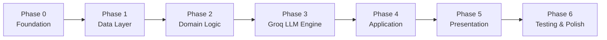
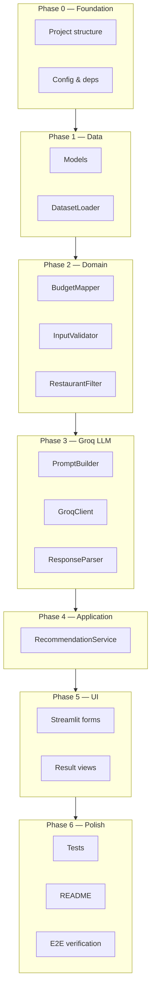

# AI-Powered Restaurant Recommendation System — Implementation Plan

This document is a **phase-wise implementation guide** derived from `[context.md](context.md)` and `[architecture.md](architecture.md)`. Each phase builds on the previous one, delivers a testable increment, and maps to the project's acceptance criteria.

---

## Plan Overview




| Phase | Name               | Primary Output                               | Depends On |
| ----- | ------------------ | -------------------------------------------- | ---------- |
| **0** | Project Foundation | Repo scaffold, config, dependencies          | —          |
| **1** | Data Layer         | Loaded & preprocessed `Restaurant` dataset   | Phase 0    |
| **2** | Domain Logic       | Filter, validator, budget mapping            | Phase 1    |
| **3** | Groq LLM Engine    | Prompt builder, Groq client, response parser | Phase 2    |
| **4** | Application Layer  | `RecommendationService` orchestration        | Phase 3    |
| **5** | Presentation Layer | Streamlit UI (forms + results)               | Phase 4    |
| **6** | Testing & Polish   | Tests, error handling, README                | Phase 5    |


**Recommended stack (from architecture):** Python 3.10+, `datasets`, `pandas`, Streamlit, **Groq** via `groq` SDK and `GroqClient`.

---

## Phase 0 — Project Foundation

### Goal

Establish the project skeleton, tooling, and configuration so later phases have a consistent structure to build on.

### Prerequisites

- Python 3.10+ installed
- Git initialized (optional)
- Groq account and API key from [console.groq.com](https://console.groq.com/keys) (needed from Phase 3 onward)

### Tasks

- [ ] Create folder structure per `[architecture.md` §6](architecture.md#6-recommended-project-structure)
- [ ] Add `requirements.txt` with core dependencies:
  - `datasets`, `pandas`, `python-dotenv`
  - `streamlit` (Phase 5)
  - `groq` (Phase 3 — Groq Chat Completions SDK)
  - `pytest` (Phase 6)
- [ ] Create `.env.example` with variables from `[architecture.md` §12](architecture.md#12-configuration)
- [ ] Implement `app/infrastructure/config.py` (`AppConfig` reading env vars)
- [ ] Add empty `__init__.py` files where needed for package imports
- [ ] Create `data/.gitkeep` for optional local cache
- [ ] Add `.gitignore` (`.env`, `__pycache__`, `data/*.parquet`, `.pytest_cache`)

### Files to Create

```
app/
├── main.py                  # placeholder entry point
├── infrastructure/
│   └── config.py
data/.gitkeep
requirements.txt
.env.example
.gitignore
```

### Verification

- [ ] `pip install -r requirements.txt` succeeds
- [ ] `AppConfig` loads defaults when env vars are absent
- [ ] Project imports resolve: `from app.infrastructure.config import AppConfig`

### Deliverable

A runnable empty project with configuration and dependency management in place.

**Estimated effort:** 1–2 hours

---

## Phase 1 — Data Layer

### Goal

Load the Zomato dataset from Hugging Face, preprocess it into normalized `Restaurant` entities, and cache for fast restarts.

### Prerequisites

- Phase 0 complete
- Network access to Hugging Face

### Tasks

- [ ] Define domain models in `app/domain/models.py`:
  - `Restaurant`
  - `UserPreferences` (needed early for filter tests in Phase 2)
  - `Recommendation`, `LLMRequest` (stubs OK; filled in later phases)
- [ ] Implement `app/infrastructure/dataset_loader.py`:
  - [ ] `load_dataset("ManikaSaini/zomato-restaurant-recommendation")` via Hugging Face `datasets`
  - [ ] Inspect raw schema and map columns to `Restaurant` fields
  - [ ] Preprocess per `[architecture.md` §9.1](architecture.md#91-startup--data-load):
    - Drop rows missing name or location
    - Normalize location (trim, lowercase for storage; display as-is)
    - Split cuisine string → `list[str]`
    - Parse cost → integer `cost_for_two`
    - Coerce rating → `float`
    - Assign stable `id` (row index or hash)
  - [ ] Optional: cache to `data/cache.parquet` when `DATASET_CACHE_PATH` is set
- [ ] Write a small exploration script or notebook cell to print:
  - Row count, column names, sample rows
  - Unique locations and cuisines (for UI dropdowns later)
  - Cost and rating distributions (to tune `BudgetMapper` in Phase 2)

### Files to Create / Modify

```
app/domain/models.py
app/infrastructure/dataset_loader.py
```

### Verification

- [ ] `DatasetLoader.load()` returns `list[Restaurant]` with no critical nulls
- [ ] Cache hit skips Hugging Face download on second run
- [ ] Sample restaurant has populated: `id`, `name`, `location`, `cuisines`, `rating`

### Deliverable

A reliable in-memory (or cached) restaurant dataset ready for filtering.

**Maps to acceptance criteria:** ✅ Zomato dataset loads successfully from Hugging Face

**Estimated effort:** 3–4 hours

---

## Phase 2 — Domain Logic (Filter & Validation)

### Goal

Implement deterministic business rules: input validation, budget mapping, and restaurant filtering — **without** the LLM.

### Prerequisites

- Phase 1 complete (real `Restaurant` list available)

### Tasks

- [ ] Implement `app/domain/budget.py` — `BudgetMapper`:
  - Map `low` / `medium` / `high` to cost ranges
  - Tune ranges using Phase 1 distribution analysis
  - Default from architecture: ₹0–500 / ₹501–1500 / ₹1501+
- [ ] Implement `app/domain/validator.py` — `InputValidator`:
  - [ ] Validate location (non-empty; optionally against known cities from dataset)
  - [ ] Validate budget enum
  - [ ] Validate cuisine (non-empty)
  - [ ] Validate `min_rating` (0.0–5.0)
  - [ ] Normalize strings (trim, case)
  - [ ] Return typed `UserPreferences` or raise/return validation errors
- [ ] Implement `app/domain/filter.py` — `RestaurantFilter`:
  - [ ] Location: case-insensitive match
  - [ ] Min rating: `rating >= min_rating`
  - [ ] Cuisine: match any entry in `restaurant.cuisines`
  - [ ] Budget: `cost_for_two` within mapped range
  - [ ] Cap results to `MAX_CANDIDATES` (default 20), sorted by rating descending
  - [ ] Return empty list gracefully (no exception)
- [ ] Add unit tests in `tests/test_filter.py` and `tests/test_budget.py` with fixture restaurants

### Files to Create / Modify

```
app/domain/budget.py
app/domain/validator.py
app/domain/filter.py
tests/test_filter.py
tests/test_budget.py
tests/conftest.py          # shared fixtures
```

### Verification

- [ ] Filter returns only restaurants matching all hard constraints
- [ ] Empty result when no restaurant matches (e.g., impossible rating)
- [ ] Candidate count never exceeds `MAX_CANDIDATES`
- [ ] All unit tests pass: `pytest tests/test_filter.py tests/test_budget.py`

### Deliverable

A testable filter pipeline: `UserPreferences` → `list[Restaurant]` candidates.

**Maps to acceptance criteria:** ✅ Structured filtering reduces the dataset to relevant candidates

**Estimated effort:** 3–4 hours

---

## Phase 3 — Groq LLM Recommendation Engine

### Goal

Build the integration layer that turns filtered candidates into Groq prompts and parses grounded, ranked recommendations with explanations.

### Prerequisites

- Phase 2 complete
- `GROQ_API_KEY` configured in `.env`

### Tasks

- [ ] Implement `app/domain/prompt_builder.py` — `PromptBuilder`:
  - [ ] System prompt with anti-hallucination rules (`[architecture.md` §10.2](architecture.md#102-system-prompt-template))
  - [ ] User prompt with preferences + serialized candidates ([§10.3](architecture.md#103-user-prompt-template))
  - [ ] Serialize candidates as compact JSON (id, name, cuisines, rating, cost_for_two)
  - [ ] Return `LLMRequest` with Groq model and temperature from config
- [ ] Implement `app/infrastructure/llm/base.py` — `LLMClient` protocol
- [ ] Implement `app/infrastructure/llm/groq_client.py` — `GroqClient`:
  - [ ] Use official `groq` SDK (`Groq(api_key=...)`)
  - [ ] Call `client.chat.completions.create()` per `[architecture.md` §9.4](architecture.md#94-llm-integration-architecture-groq)
  - [ ] Default model: `llama-3.3-70b-versatile`
  - [ ] Wire via `get_llm_client()` in config (returns `GroqClient`)
- [ ] Implement `app/domain/response_parser.py` — `LLMResponseParser`:
  - [ ] Parse JSON from LLM response (handle markdown code fences)
  - [ ] Validate `restaurant_id` against candidate set
  - [ ] Strip hallucinated entries
  - [ ] Merge explanation with canonical `Restaurant` from dataset
  - [ ] Sort by rank, truncate to `top_n`
  - [ ] Fallback: rating-sorted list without explanations if JSON parse fails
- [ ] Add unit tests:
  - [ ] `tests/test_prompt_builder.py` — prompt contains prefs and all candidate IDs
  - [ ] `tests/test_response_parser.py` — valid JSON, malformed JSON, hallucinated IDs

### Files to Create / Modify

```
app/domain/prompt_builder.py
app/domain/response_parser.py
app/infrastructure/llm/base.py
app/infrastructure/llm/groq_client.py
app/domain/models.py                        # finalize LLMRequest, Recommendation
tests/test_prompt_builder.py
tests/test_response_parser.py
tests/fixtures/sample_llm_response.json
```

### Verification

- [ ] Manual test: build prompt from 5 mock candidates → inspect output
- [ ] Manual test: call Groq API with real key → receive JSON response
- [ ] Parser rejects restaurant IDs not in candidate list
- [ ] All unit tests pass for prompt builder and parser

### Deliverable

Working prompt → Groq → parsed `list[Recommendation]` pipeline (testable in isolation).

**Maps to acceptance criteria:**

- ✅ Groq LLM receives a well-formed prompt and returns ranked recommendations with explanations
- ✅ Recommendations are grounded in real dataset records

**Estimated effort:** 5–6 hours

---

## Phase 4 — Application Layer (Orchestration)

### Goal

Wire all components into a single `RecommendationService` that implements the full backend workflow.

### Prerequisites

- Phases 1–3 complete

### Tasks

- [ ] Implement `app/application/recommendation_service.py`:
  ```python
  def get_recommendations(prefs: UserPreferences) -> list[Recommendation]:
      # 1. validate
      # 2. filter → candidates
      # 3. if empty → return [] (with optional message field)
      # 4. build prompt
      # 5. Groq complete (with retry on transient error)
      # 6. parse response
      # 7. return recommendations
  ```
- [ ] Load dataset once at service init (or inject via constructor for testability)
- [ ] Implement error handling per `[architecture.md` §11](architecture.md#11-error-handling-strategy):
  - [ ] Validation errors → do not call LLM
  - [ ] Zero candidates → skip LLM, return empty
  - [ ] Groq failure → retry once, then fallback message
- [ ] Add integration test with mocked `GroqClient` in `tests/test_recommendation_service.py`
- [ ] Add CLI smoke test in `app/main.py` (optional interim UI):
  - Accept prefs via argparse or simple input()
  - Print recommendations to terminal

### Files to Create / Modify

```
app/application/recommendation_service.py
app/main.py
tests/test_recommendation_service.py
```

### Verification

- [ ] End-to-end CLI run: prefs in → ranked recommendations out
- [ ] Empty filter result does **not** trigger Groq call (assert via mock)
- [ ] Integration test passes with mocked Groq client

### Deliverable

Complete backend pipeline callable via `RecommendationService.get_recommendations()`.

**Estimated effort:** 2–3 hours

---

## Phase 5 — Presentation Layer (UI)

### Goal

Build a user-friendly Streamlit interface for preference input and recommendation display.

### Prerequisites

- Phase 4 complete

### Tasks

- [ ] Implement `app/presentation/forms.py`:
  - [ ] Location: dropdown populated from unique dataset locations (or text input)
  - [ ] Budget: selectbox (Low / Medium / High)
  - [ ] Cuisine: dropdown or text input from dataset cuisines
  - [ ] Minimum rating: slider (0.0–5.0)
  - [ ] Additional preferences: text area
  - [ ] Submit button
- [ ] Implement `app/presentation/views.py`:
  - [ ] Display each recommendation: name, cuisine, rating, cost, explanation
  - [ ] Optional summary line from Groq
  - [ ] Empty state: "No restaurants match. Try relaxing filters."
  - [ ] Loading spinner during Groq API call
  - [ ] Error banner for validation / API failures
- [ ] Update `app/main.py` as Streamlit entry point:
  - [ ] `@st.cache_resource` for `DatasetLoader` and `RecommendationService`
  - [ ] Wire form → service → view
- [ ] Run: `streamlit run app/main.py`

### Files to Create / Modify

```
app/presentation/forms.py
app/presentation/views.py
app/main.py
```

### Verification

- [ ] User can submit all five preference types from the UI
- [ ] Results show: restaurant name, cuisine, rating, estimated cost, AI explanation
- [ ] Invalid input shows validation message without crashing
- [ ] Loading state visible during Groq request

### Deliverable

Fully interactive web app for restaurant recommendations.

**Maps to acceptance criteria:**

- ✅ User can specify location, budget, cuisine, minimum rating, and additional preferences
- ✅ Output displays restaurant name, cuisine, rating, estimated cost, and AI explanation

**Estimated effort:** 3–4 hours

---

## Phase 6 — Testing, Hardening & Delivery

### Goal

Finalize quality, documentation, and acceptance verification for Milestone 1 delivery.

### Prerequisites

- Phase 5 complete

### Tasks

- [ ] Complete test suite:
  - [ ] All unit tests (`filter`, `budget`, `prompt_builder`, `response_parser`)
  - [ ] Integration test (`recommendation_service` with mock Groq client)
  - [ ] Optional: live Groq test behind `pytest -m live` flag
- [ ] Run full `pytest` and fix failures
- [ ] Security check:
  - [ ] `.env` in `.gitignore`
  - [ ] No API keys in source code
- [ ] Tune constants:
  - [ ] `MAX_CANDIDATES`, budget ranges, Groq temperature
  - [ ] Verify latency < 5s for typical request (Groq inference is fast)
- [ ] Write `README.md`:
  - [ ] Project description
  - [ ] Setup instructions (`pip install`, `.env` with `GROQ_API_KEY`)
  - [ ] How to run (`streamlit run app/main.py`)
  - [ ] Architecture overview (link to `architecture.md`)
  - [ ] Example screenshot or sample output (optional)
- [ ] Manual E2E test checklist (see below)
- [ ] Code cleanup: remove debug prints, unused imports

### Files to Create / Modify

```
README.md
tests/                       # complete coverage
pytest.ini or pyproject.toml # optional pytest config
```

### Manual E2E Test Checklist


| #   | Scenario                                | Expected Result                         |
| --- | --------------------------------------- | --------------------------------------- |
| 1   | Bangalore + Medium + North Indian + 4.0 | Top 5 recommendations with explanations |
| 2   | Invalid location / empty cuisine        | Validation error, no Groq call          |
| 3   | Min rating 5.0 + restrictive filters    | Empty state message                     |
| 4   | Additional pref: "family-friendly"      | Explanations reference the preference   |
| 5   | Invalid / missing `GROQ_API_KEY`        | Graceful error, no crash                |


### Final Acceptance Checklist

Cross-reference `[context.md` acceptance criteria](context.md#acceptance-criteria):

- [ ] Zomato dataset loads successfully from Hugging Face
- [ ] User can specify location, budget, cuisine, minimum rating, and additional preferences
- [ ] Structured filtering reduces the dataset to relevant candidates
- [ ] Groq LLM receives a well-formed prompt and returns ranked recommendations with explanations
- [ ] Output displays restaurant name, cuisine, rating, estimated cost, and AI explanation
- [ ] Recommendations are grounded in real dataset records (no hallucinated restaurants)

### Deliverable

Production-ready Milestone 1 submission: tested app, README, and passing acceptance criteria.

**Estimated effort:** 3–4 hours

---

## Phase Dependency Diagram




---

## Effort Summary


| Phase                | Estimated Hours | Cumulative |
| -------------------- | --------------- | ---------- |
| 0 — Foundation       | 1–2             | 1–2        |
| 1 — Data Layer       | 3–4             | 4–6        |
| 2 — Domain Logic     | 3–4             | 7–10       |
| 3 — Groq LLM Engine  | 5–6             | 12–16      |
| 4 — Application      | 2–3             | 14–19      |
| 5 — Presentation     | 3–4             | 17–23      |
| 6 — Testing & Polish | 3–4             | 20–27      |


**Total estimated effort:** ~20–27 hours for a complete Milestone 1 implementation.

---

## Risk Register & Mitigations


| Risk                                     | Phase | Impact  | Mitigation                                             |
| ---------------------------------------- | ----- | ------- | ------------------------------------------------------ |
| Dataset schema differs from expected     | 1     | Blocker | Explore raw data first; adjust column mapping          |
| Cost field unparseable (ranges, symbols) | 1     | Medium  | Regex extraction; fallback to median tier              |
| Groq returns malformed JSON              | 3     | Medium  | Retry prompt; parser fallback to rating sort           |
| Groq hallucinates restaurant IDs         | 3     | High    | Strict ID validation in `ResponseParser`               |
| Too many candidates → token limit        | 3     | Medium  | Enforce `MAX_CANDIDATES=20` in filter                  |
| Groq rate limits / API errors            | 3, 5  | Medium  | Retry with backoff; use `llama-3.1-8b-instant` for dev |
| No restaurants match filters             | 2, 5  | Low     | Empty state UX; suggest relaxing filters               |


---

## Optional Enhancements (Post–Milestone 1)

These are **out of scope** per `[context.md](context.md)` but can follow Phase 6:

- FastAPI REST endpoint wrapping `RecommendationService`
- Alternative Groq models (e.g. `mixtral-8x7b-32768`) via config
- Recommendation history / session persistence
- Export results to CSV or PDF
- Docker containerization

---

## Quick Start Command Sequence

After completing all phases:

```bash
# Setup
python -m venv venv
venv\Scripts\activate          # Windows
pip install -r requirements.txt
copy .env.example .env         # add GROQ_API_KEY

# Test
pytest

# Run
streamlit run app/main.py
```

---

## References

- `[context.md](context.md)` — Objectives, user inputs, acceptance criteria
- `[architecture.md](architecture.md)` — Components, data models, workflows, ADRs
- `[ProblemStatement.txt](ProblemStatement.txt)` — Original requirements
- [Hugging Face Dataset](https://huggingface.co/datasets/ManikaSaini/zomato-restaurant-recommendation)
- [Groq Console](https://console.groq.com/) — API keys and model catalog
- [Groq Python SDK](https://github.com/groq/groq-python)

